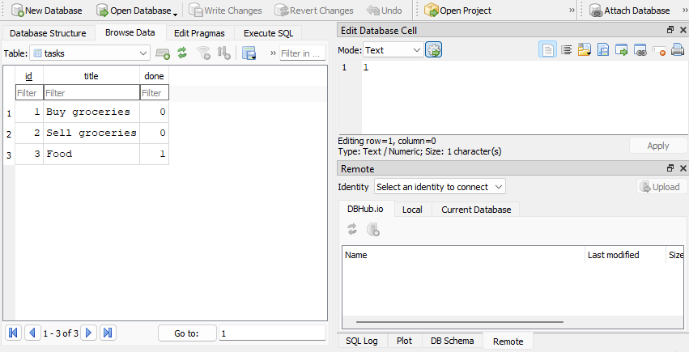
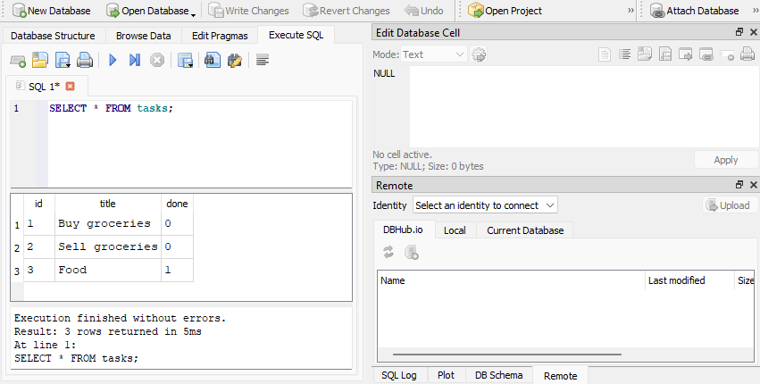

# Task API
**Status:** ✅ Complete

A CRUD REST API for a to-do list, built with Python, FastAPI, and SQLite. The HTTP endpoints keep the same behavior as the original in-memory version, while every task is now stored on disk and survives server restarts.

## Why SQLite

SQLite keeps the entire database in one file, needs no separate database server, and requires no manual setup. It is a good fit for this project because `tasks.db` is created automatically and preserves data between application restarts.

The database file lives at `tasks.db` in the project root. It is excluded by `.gitignore`, so every clone creates a fresh local database with the three example tasks on its first run.

## Install and run

Python 3.10 or newer is required.
```bash
python -m pip install fastapi uvicorn
```

Start the API with one command:

```bash
python -m uvicorn main:app --reload
```

## Endpoints

| Method | Endpoint | Success |
| --- | --- | --- |
| `GET` | `/tasks` | `200` with all tasks |
| `GET` | `/tasks/{id}` | `200` with one task |
| `POST` | `/tasks` | `201` with the created task |
| `PUT` | `/tasks/{id}` | `200` with the updated task |
| `DELETE` | `/tasks/{id}` | `204` with an empty body |

Invalid request bodies return `400`, and unknown task IDs return `404`. Errors use the JSON shape `{"error": "message"}`.

## SQLite database

The application automatically creates the `tasks` table with `id`, `title`, and `done` columns. It seeds three example tasks only when the table is empty, so starting the application repeatedly does not create duplicates.




## SQL exploration

One query run during Stage 4 was:

```sql
SELECT * FROM tasks;
```

It returned all three seeded tasks. Changes made directly with SQL were immediately visible through `GET /tasks` because both operations use the same `tasks.db` file.

The CRUD storage layer uses parameterized placeholders for every value supplied to `SELECT`, `INSERT`, `UPDATE`, and `DELETE` queries.
