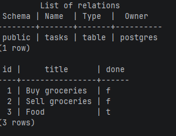

# Task API
**Status:** 🚧 In Progress

A CRUD REST API for a to-do list, built with Python, FastAPI, PostgreSQL, and Docker Compose. The API and database run in separate containers, while a named Docker volume keeps tasks across stack restarts.

## Run the whole stack

Docker Desktop or Podman with Docker Compose is required. PostgreSQL does not need to be installed separately.

Create the local environment file from the committed template:

```powershell
Copy-Item .env.example .env
```

Set the values described in `.env.example`, then start the API and PostgreSQL with one command:

```bash
docker compose up
```

The API is available at `http://localhost:3000`. Stop the stack with `Ctrl+C`. `docker compose down` removes the containers but keeps the named `taskdata` volume and its rows.

## Environment variables

| Variable | Purpose |
| --- | --- |
| `POSTGRES_USER` | Local PostgreSQL user |
| `POSTGRES_PASSWORD` | Local PostgreSQL password |
| `POSTGRES_DB` | Database name |
| `DATABASE_URL` | Connection string used by the API; the host is the Compose service name `db` |

## Endpoints

| Method | Endpoint | Success |
| --- | --- | --- |
| `GET` | `/tasks` | `200` with all tasks |
| `GET` | `/tasks/{id}` | `200` with one task |
| `POST` | `/tasks` | `201` with the created task |
| `PUT` | `/tasks/{id}` | `200` with the updated task |
| `DELETE` | `/tasks/{id}` | `204` with an empty body |

Invalid request bodies return `400`, and unknown task IDs return `404`. Errors use the JSON shape `{"error": "message"}`.

## Database setup

The application automatically creates the PostgreSQL `tasks` table with `id`, `title`, and `done` columns. It seeds three example tasks only when the table is empty, so repeated restarts do not create duplicates.

PostgreSQL data lives in the Docker named volume `taskdata`, not in the repository. To inspect the table and rows directly:

```bash
docker compose exec db psql -U postgres -d tasks -c "\dt"
docker compose exec db psql -U postgres -d tasks -c "SELECT * FROM tasks;"
```



## curl example

```text
$ curl -i http://localhost:3000/tasks
HTTP/1.1 200 OK
server: uvicorn
content-length: 130
content-type: application/json

[{"id":1,"title":"Buy groceries","done":false},{"id":2,"title":"Sell groceries","done":false},{"id":3,"title":"Food","done":true}]
```

## SQL verification

One query for checking the seeded Postgres rows is:

```sql
SELECT * FROM tasks;
```

It returns the three seeded tasks. Changes made directly in PostgreSQL are visible through `GET /tasks` because the API reads from the same database.

The CRUD storage layer uses parameterized placeholders for every value supplied to `SELECT`, `INSERT`, `UPDATE`, and `DELETE` queries.
